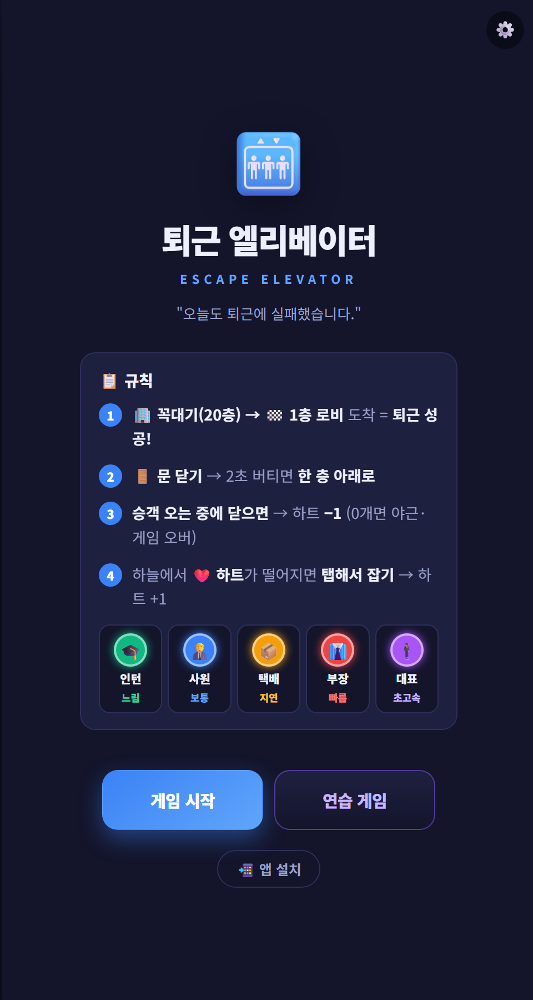
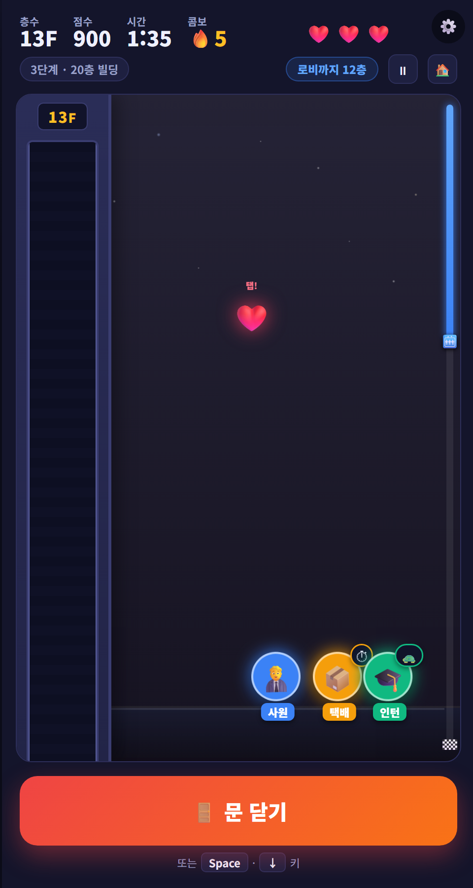

# 퇴근 엘리베이터 (Escape Elevator)

문이 닫히기 직전 뛰어드는 사람들을 피해, 꼭대기 층에서 **1층 로비까지 내려가 퇴근**하는 캐주얼 웹게임 (PWA).
기획·명세: [docs/](docs/) — [기획안](docs/planning.html) · [기능 명세서](docs/기능명세서.html) · [사용자 흐름](docs/user-flow.html)

<p align="center">
  
  &nbsp;&nbsp;
  
</p>

## 실행

별도 빌드 없음.
- **간단히**: `index.html` 더블클릭 (게임은 동작, 단 PWA 설치·오프라인은 안 됨)
- **권장(PWA 포함)**: 로컬 서버로 열어 `http://localhost:포트` 접속
  ```bash
  python -m http.server 8137    # 또는: npx serve
  ```
  → `http://localhost:8137` 접속.

## 게임 규칙

- 🏢 꼭대기(20층)에서 🏁 **1층 로비까지** 내려가면 **퇴근 성공**.
- 🚪 **문 닫기**(버튼 / `Space`·`↓`·`Enter`) → **2초** 버티면 한 층 아래로.
- 승객이 **오는 중에 닫으면 실패** → 하트 −1. ❤️ **하트 0개면 게임 오버**(야근).
- 하늘에서 떨어지는 **❤️ 보너스 하트를 탭해서** 잡으면 +1 (단계마다 등장).
- 시작 시 **3·2·1·START** 카운트다운 · 일시정지 ⏸/`Esc`/`P` · 시작 하트 3개(4·5단계 4·5개).

## 단계 (꼭대기 → 1층)

모든 단계 **20층 통일**, 난이도(생성·이동 속도)로 차등. 어려운 단계일수록 보너스 하트를 더 주고, **4·5단계는 시작 하트도 4·5개**.

| 단계 | 빌딩 | 난이도 | 보너스 하트 | 비고 |
| --- | --- | --- | --- | --- |
| 1단계 느긋한 오후 | 20층 | ★ | ❤️×1 | 드뭄·느림 |
| 2단계 평범한 퇴근 | 20층 | ★★ | ❤️×2 | 표준 |
| 3단계 러시아워 | 20층 | ★★★ | ❤️×3 | 자주·빠르게 |
| 4단계 야근 지옥 | 20층 | ★★★★ | ❤️×4 | 쉴 틈 없음 |
| 5단계 대표님 등장 | 20층 | ★★★★★ | ❤️×5 | **대표🕴️ 출현** |
| 🎯 연습 게임 | 6층 | - | - | **위험 미리보기**(빨간 표시) 켜짐 |

## 승객

| 승객 | 등장 | 특징 | 충돌 시 |
| --- | --- | --- | --- |
| 🎓 인턴 | 20% | 느림 | 하트 −1 |
| 🧑‍💼 사원 | 60% | 보통 | 하트 −1 |
| 📦 택배 | 10% | 닫기 지연 유발 | 하트 −1 |
| 👔 부장 | 10% | 빠름 | 하트 −1 |
| 🕴️ 대표 | 5단계 한정 | **초고속** | 하트 −1 |

> 하트 소모는 모두 −1로 동일. 차이는 속도·특수효과(지연)·등장 단계.

## 오디오

`sounds/` 폴더의 mp3를 사용합니다 (없으면 무음). 효과음 🔊 / 배경음 🎵 **각각 토글**(우상단, 설정 저장).
파일 매핑·교체는 [js/audio.js](js/audio.js)의 `FILES` 참고.

## PWA (설치 / 오프라인)

`manifest.webmanifest` + Service Worker(`sw.js`, **network-first** → 온라인 최신·오프라인 캐시) 포함.
- 설치: PC 크롬/엣지 주소창 **설치 아이콘** 또는 `⋮` → "앱 설치", 모바일은 "홈 화면에 추가".
- 설치/오프라인은 `localhost` 또는 **HTTPS**에서만 동작(폰 설치는 HTTPS 배포 필요).

## 구조

```
index.html            진입점 (메인 / 단계선택 / 게임 / 결과 화면)
styles.css            스타일 (모바일 우선, DOM 렌더링)
manifest.webmanifest  PWA 매니페스트
sw.js                 서비스워커 (network-first)
favicon.png, icons/   아이콘 (192/512/apple-touch)
js/
  config.js   밸런스 상수 · 승객 · 단계 정의
  storage.js  LocalStorage 추상화 (단계별 최고 점수)
  audio.js    효과음/배경음 매니저 (토글)
  game.js     게임 상태 + 순수 로직 (DOM 비의존)
  ui.js       상태 → DOM 렌더링 + 연출 (카운트다운·하강·배경 등)
  main.js     게임 루프(rAF+delta) + 입력 + PWA/오디오 배선
sounds/       효과음·배경음 mp3 (button/closedoor/racestart/fail/recover/victory/youlose/tick/bgm)
docs/         기획·명세 문서 (HTML)
```

설계 원칙: 로직/화면 분리 · 저장소 추상화 · pointer 입력 · delta-time 루프 · 진행도 기반 난이도.
